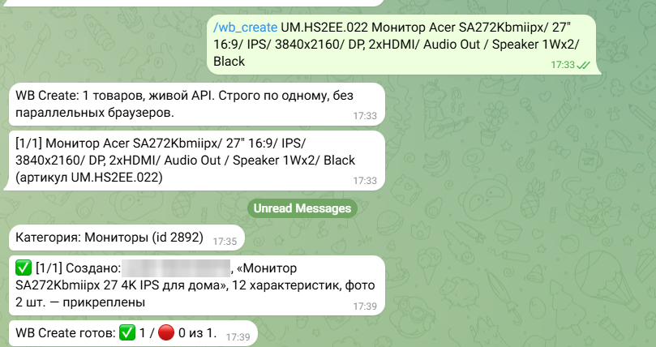
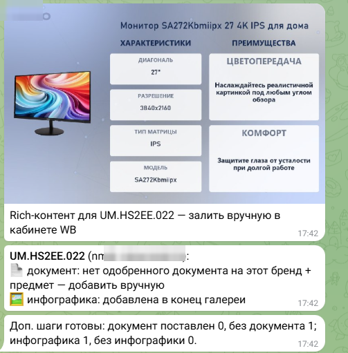
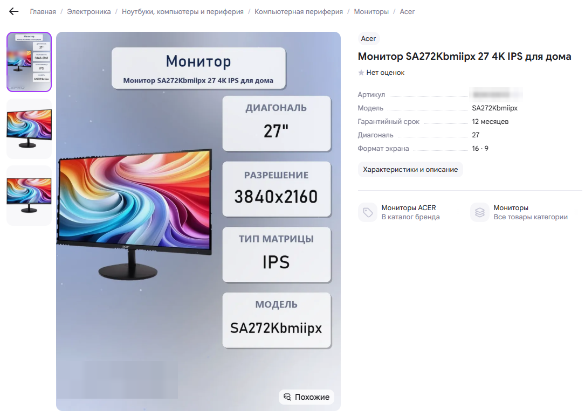
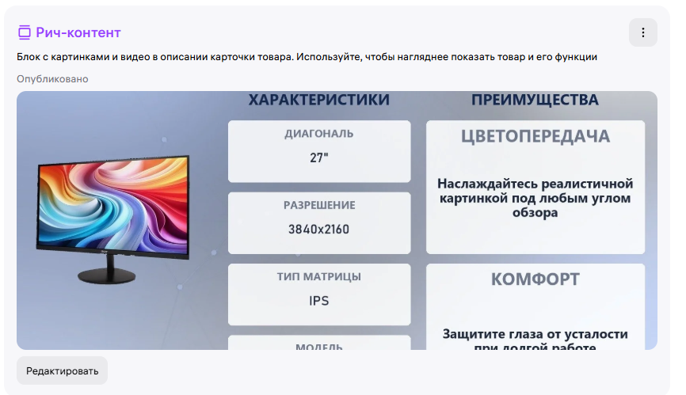
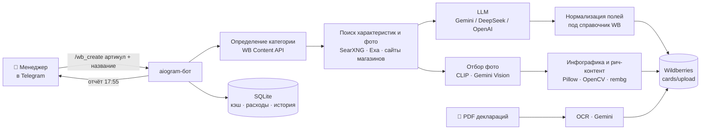

<div align="center">

# 🤖 AI Marketplace Bot

**Telegram-бот, который делает за менеджера маркетплейса самую долгую и скучную работу.**
Из одной строки «артикул + название» он создаёт готовую карточку товара на **Wildberries** и **Ozon**: с характеристиками, описанием, фото, инфографикой и документами соответствия.


</div>

> Проект опубликован как портфолио. Ключи, данные магазина, рабочая база и промпты в репозиторий не входят. Использовать код без разрешения автора нельзя, подробности в [LICENSE](LICENSE).

---

## Зачем он нужен

Чтобы завести одну карточку на Wildberries вручную, менеджеру нужно найти характеристики модели, разобраться, какие поля обязательны именно в этой категории, написать название и SEO-описание, подобрать и обработать фото, нарисовать инфографику, проставить код ТН ВЭД и привязать декларацию соответствия. На одну карточку уходит 20–30 минут, на сотню — неделя работы.

Бот делает всё это сам. Человек отправляет список товаров в Telegram и получает готовые карточки на маркетплейсе.

## Результаты в реальной работе

Бот каждый день работает в магазине электроники. Цифры ниже взяты из рабочих отчётов и логов бота.

**Документы соответствия: один рабочий день (29.09.2026)**

| Маркетплейс | Документов | Карточек получили документ |
|---|---|---|
| Wildberries | **327** | **1 424** |
| Ozon | **117** | **3 050** |

**Создание карточек**

| Показатель | Значение |
|---|---|
| 🚀 Рекорд за день (14.08.2026) | **151 карточка**: 72 на WB с нуля и 79 на Ozon |
| ⏱ Время бота на одну карточку, от названия до карточки на WB | **4–5 минут**, без участия человека |
| 🧑‍💼 Сэкономлено времени менеджера за 10 рабочих дней (11.08–01.09.2026)* | **≈ 250 часов** (около 30 рабочих дней) |

<sub>* Оценка по логам бота: карточки, созданные через Telegram за этот период, × ~25 минут ручного заполнения одной карточки. Сюда не входят карточки Ozon, документы и работа за другие периоды.</sub>

Ещё что даёт бот:
- **Без ошибок в обязательных полях.** Бот берёт список характеристик категории прямо из API WB и заполняет каждое поле в нужном формате.
- **Работает пачками.** Если на одном товаре что-то пошло не так, бот объясняет причину и переходит к следующему, а не останавливает весь список.
- **Дёшево.** Вся инфографика рисуется локально, а для текстов можно оставаться в бесплатных лимитах Gemini. Все траты на ИИ видны по команде `/costs`.

## Как это выглядит

Одна команда в Telegram, и карточка появляется на Wildberries:



Затем бот сам рисует инфографику и рич-контент и прикрепляет их к карточке:



Готовая карточка на Wildberries:





## Возможности

### 🛒 Карточки Wildberries
- `/wb_create`: карточка с нуля через Content API. Бот сам определяет категорию, заполняет обязательные и популярные характеристики, габариты, код ТН ВЭД и загружает фото.
- `/wb_batch`: заполнение Excel-шаблона WB для массовой загрузки.
- Библиотека кодов ТН ВЭД, которая сама пополняется, и средние габариты по категориям.
- Вечерний отчёт в Telegram: что создано, что отклонено, нагрузка на ПК. Плюс Excel-файл.

### 📄 Декларации и сертификаты соответствия (новое)
- Читает PDF и сканы документов: номер, тип и сроки действия. Работает через текстовый слой, OCR (EasyOCR) или Gemini Vision.
- Сам сопоставляет документы с карточками по бренду, модели и категории.
- Делает снимок всего каталога WB и показывает статус документа у каждой карточки: одобрен, на проверке, отклонён или отсутствует.
- Загружает документы пакетом. Сначала показывает **план без отправки**, потом спрашивает подтверждение. Через 90 секунд перепроверяет каждую карточку: встал документ или нет.
- Никогда не трогает карточки, где документ уже одобрен или на проверке, чтобы не сбросить проверку.
- Для Ozon, у которого нет API для сертификатов, есть автозаполнение веб-формы через Playwright.

### 🎨 Инфографика и фото
- Десяток шаблонов под категории: мыши, колонки, игровые девайсы, ОЗУ, видеокарты, сетевое оборудование, часы, кресла.
- Удаление фона (rembg), подбор цветов под товар, водяной знак магазина.
- Поиск фото через SearXNG и Exa, отбор лучшего кадра с помощью CLIP и Gemini Vision.
- Бесплатный режим: инфографика по готовой карточке рисуется **без вызовов ИИ**.
- Видеообложки для WB (MiniMax / Hailuo).

### ✍️ Тексты
- SEO-название, описание и характеристики под требования категории.
- Несколько LLM-провайдеров с общим интерфейсом и переключением одной командой (`/model`).

### 🟦 Ozon
- Создание карточек через Seller API, заполнение Excel-шаблонов, хостинг фото в Cloudflare R2.

### ⚙️ Администрирование
- Доступ только для разрешённых пользователей (`/adduser`, `/users`).
- `/health`: баланс LLM, доступность API WB и Ozon, свободное место на диске.
- `/costs`: расходы на ИИ за сегодня, неделю и месяц.
- Сторож (watchdog) сам перезапускает бота, если тот упал.

## Как устроен



```
main.py              точка входа, роутеры, планировщик отчётов
config.py            настройки из .env
handlers/            команды Telegram: WB, Ozon, карточки, фото, видео, админка
services/
  card/              категории, бренды, генерация и нормализация карточки
  llm/               провайдеры LLM с общим интерфейсом
  search/            поиск контекста и фото, кэш
  image/             инфографика, фоны, шрифты, CLIP-оценка, логотипы брендов
  ozon/              клиент Ozon Seller API
  video/             видеообложки
  wb_create.py       конвейер создания карточек WB
prompts/             промпты (в публичной версии скрыты)
database/            SQLite: пользователи, кэш, расходы, история карточек
utils/               биллинг, отчёты, Excel, контроль нагрузки на GPU
tools/               модуль документов соответствия, бесплатная инфографика
scripts/             .bat-ярлыки для запуска инструментов в Windows двойным кликом
```

## Стек

**Язык и бот:** Python 3.11, aiogram 3, asyncio, aiosqlite, pydantic-settings
**ИИ:** Gemini (тексты и Vision), DeepSeek, OpenAI, CLIP (transformers + PyTorch, CUDA)
**Компьютерное зрение:** Pillow, OpenCV, rembg (U²-Net, onnxruntime), Ultralytics YOLO, EasyOCR, PyMuPDF
**Поиск:** SearXNG (self-hosted), Exa, trafilatura
**Интеграции:** Wildberries Content API, Ozon Seller API, Cloudflare R2 (boto3), MiniMax / Hailuo, Playwright
**Данные:** SQLite, openpyxl

## Установка

Коротко:

```bash
git clone https://github.com/zxcbecause/ai-marketplace-bot.git
cd ai-marketplace-bot
python -m venv .venv && .venv\Scripts\activate
pip install -r requirements.txt
copy .env.example .env      # и заполнить ключи
python main.py
```

Чтобы на Windows бот поднимался сам после включения или перезагрузки ПК (без сна, с автозапуском и сторожем), один раз запустите `scripts\Настроить_автозапуск.bat`.

## Тесты

```bash
pip install -r requirements-dev.txt
pytest
```

Тесты покрывают нормализацию номеров деклараций и сертификатов ЕАЭС и определение статуса документа на карточке WB. В GitHub Actions они запускаются вместе с ruff при каждом пуше.

## Автор

**Turdaly Dias** · [GitHub @zxcbecause](https://github.com/zxcbecause) · [Telegram @zxcbecause](https://t.me/zxcbecause)
